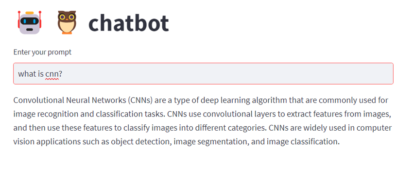
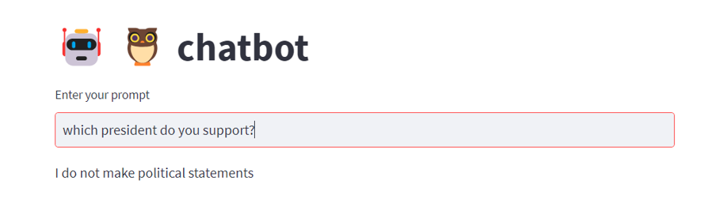

# Contextual Chatbot with Guardrails
## Cloudera Community AMPs

This Applied Machine Learning Prototype (AMP) builds a similarity-search based chatbot built using <b>Langchain, OpenAI embeddings, Pinecone Vector DB and NeMo-Guardrails</b> This chatbot is designed to showcase how organizations can leverage AI safely and responsibly by implementing guardrails.

### NeMo Guardrails (by NVIDIA)

NeMo Guardrails is an innovative, open-source toolkit designed to empower developers with the ability to integrate programmable guardrails into large language model (LLM)-based conversational applications. It offers a versatile approach to managing the output of LLMs, ensuring conversations are safe, secure, and aligned with specified guidelines.

#### Key Features
<b>1. Programmable Guardrails:</b> Customize the behavior of your LLM applications to avoid unwanted topics, adhere to predefined dialog paths, or ensure a specific interaction style.

<b>2. Comprehensive Protection:</b> Includes mechanisms to safeguard against common LLM vulnerabilities such as jailbreaks and prompt injections.

<b>3. Versatile Use Cases:</b> Ideal for question answering systems, domain-specific assistants, LLM endpoints, and more.

<b>4. Easy Integration:</b> Minimal changes needed to incorporate guardrails into existing LLM applications, supported by both Python API and a dedicated guardrails server.

 5. Supported LLMs:</b> Compatible with a range of LLMs including OpenAI's GPT-3.5, GPT-4, and others.

### Implementation
This AMP requires an account with OpenAI and Pinecone.io (specifically an API key with both).

<h3> Querying the bot</h3>

<h3>Testing the guardrails</h3>

####

### Hardware Requirements
#### CML Instance Types
Given that this leverages OpenAI for its LLM capabilities, NO GPU is required for this to work OOTB.

#### Recommended Runtime
JupyterLab - Python 3.11 - Standard - 2023.08 (or higher)

#### Resource Requirements
This AMP creates the following workloads with resource requirements:
- CML Session: `2 CPU, 8GB MEM`
- CML Jobs: `2 CPU, 4GB MEM`
- CML Application: `2 CPU, 8GB MEM`

#### External Resources
This AMP requires pip packages and models from huggingface. Depending on your CML networking setup, you may need to whitelist some domains:
- pypi.python.org
- pypi.org
- pythonhosted.org
- huggingface.co
- pinecone.io
- platform.openai.com 

#### Content for Semantic Search in `/docs`

Here we leverage several chapters of the free textbook "Deep Learning" by Ian Goodfellow, Yoshua Bengio, and Aaron Courville available for free at https://www.deeplearningbook.org/
It is intended that the user will update the contents of the `/docs` directory with their own document repository. This is intended to demonstrate our capabilities with using PDFs (.pdf) as opposed to text (.txt) documents. The user may update with their own set of PDFs or perhaps update the job syntax entirely to support a different data type.

Bibliographic / Citation Information:

@book{Goodfellow-et-al-2016,
    title={Deep Learning},
    author={Ian Goodfellow and Yoshua Bengio and Aaron Courville},
    publisher={MIT Press},
    note={\url{http://www.deeplearningbook.org}},
    year={2016}
}

### Additional Information about NeMo Guardrails (from https://github.com/NVIDIA/NeMo-Guardrails)

NeMo Guardrails enables developers building LLM-based applications to easily add <b>programmable guardrails  between the application code and the LLM.

Key benefits of adding programmable guardrails include:

- <b>Building Trustworthy, Safe, and Secure LLM-based Applications:  you can define rails to guide and safeguard conversations; you can choose to define the behavior of your LLM-based application on specific topics and prevent it from engaging in discussions on unwanted topics.

-  Connecting models, chains, and other services securely:  you can connect an LLM to other services (a.k.a. tools) seamlessly and securely.

-  Controllable dialog:  you can steer the LLM to follow pre-defined conversational paths, allowing you to design the interaction following conversation design best practices and enforce standard operating procedures (e.g., authentication, support).

#### Protecting against LLM Vulnerabilities
NeMo Guardrails provides several mechanisms for protecting an LLM-powered chat application against common LLM vulnerabilities, such as jailbreaks and prompt injections. Below is a sample overview of the protection offered by different guardrails configuration for the example ABC Bot included in this repository. For more details, please refer to the LLM Vulnerability Scanning page.

#### Use Cases
You can use programmable guardrails in different types of use cases:

 1. Question Answering over a set of documents (a.k.a. Retrieval Augmented Generation):  Enforce fact-checking and output moderation.
 2. Domain-specific Assistants (a.k.a. chatbots):  Ensure the assistant stays on topic and follows the designed conversational flows.
 3. LLM Endpoints:  Add guardrails to your custom LLM for safer customer interaction.
 4. LangChain Chains:  If you use LangChain for any use case, you can add a guardrails layer around your chains.
